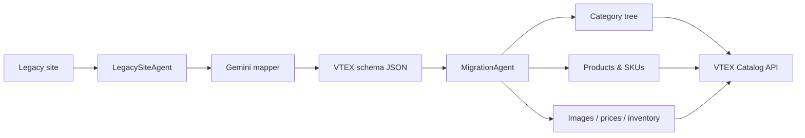

# Agent Catalog Creator

An agent-based toolkit for migrating product catalogs into **VTEX**. It crawls a legacy e-commerce site, uses **Google Gemini** to map HTML into a VTEX-shaped schema, and publishes departments, categories, brands, products, SKUs, prices, inventory, and images through the VTEX Catalog API.

A companion script generates AI product photography when source images are missing or you need synthetic catalog assets.

## What it does

The main workflow is orchestrated by `MigrationAgent` in six interactive phases:

| Step | Phase | Description |
|------|-------|-------------|
| 1 | **Discovery** | Collect the source website URL |
| 2 | **Mapping** | Find product URLs via sitemap or recursive crawl |
| 3 | **Extraction** | Scrape pages and map content to VTEX schema with Gemini |
| 4 | **Sampling** | Choose how many products to import |
| 5 | **Reporting** | Analyze catalog structure and write a migration plan |
| 6 | **Execution** | Create the catalog in VTEX (requires explicit `APPROVED`) |

Progress is persisted under `state/` so you can resume or reuse earlier steps.



## Requirements

- Python 3.10+
- A VTEX account with Catalog API credentials (for execution phase)
- A [Google Gemini API key](https://ai.google.dev/) (for extraction and optional image generation)
- GitHub credentials (optional — only needed for AI image upload via `generate_catalog_images.py`)

## Installation

```bash
git clone <repo-url>
cd agent-catalog-creator

python -m venv .venv
source .venv/bin/activate   # Windows: .venv\Scripts\activate

pip install -r requirements.txt
```

## Configuration

Create a `.env` file in the project root:

```env
# Required for extraction & image generation
GEMINI_API_KEY=your_gemini_api_key
GEMINI_MODEL=gemini-2.0-flash          # optional, default shown
GEMINI_IMAGE_MODEL=gemini-2.5-flash-image  # optional, for image script

# Required for VTEX execution (step 6)
VTEX_ACCOUNT_NAME=your_account
VTEX_APP_KEY=your_app_key
VTEX_APP_TOKEN=your_app_token
VTEX_WAREHOUSE_ID=1_1                  # optional

# Required for AI image upload to GitHub
GITHUB_TOKEN=your_github_pat
GITHUB_REPO=owner/repo                 # or full https://github.com/owner/repo URL
GITHUB_BRANCH=main                     # optional

# Optional overrides
GEMINI_BASE_URL=                       # custom Gemini endpoint
CATALOG_IMAGE_BASE_URL=                # base URL for optimize_sku_variants.py
```

## Running the migration workflow

Start the interactive migration from the project root:

```bash
python -c "from vtex_agent.agents import MigrationAgent; MigrationAgent().run_full_workflow()"
```

During execution you will be prompted to:

- Confirm or override saved state from previous runs
- Choose how many products to import (`all` or a number)
- Review the generated plan in `state/final_plan.md`
- Type `APPROVED` before anything is written to VTEX

### Execution order per product

For each product the agent creates:

1. Product record
2. SKU(s)
3. Image associations (SKUs stay inactive until images are attached)
4. SKU activation (when images exist)
5. Price and inventory (100 units across warehouses)

> **Note:** Product specifications are currently disabled — no specification fields are created or set in VTEX.

### Custom extraction prompts

Tune how Gemini interprets product pages:

```bash
python -m vtex_agent.tools.prompt_manager_cli show
python -m vtex_agent.tools.prompt_manager_cli edit
python -m vtex_agent.tools.prompt_manager_cli clear
```

## Catalog image generator

`scripts/generate_catalog_images.py` creates studio-style product photos with Gemini, uploads them to GitHub, and patches image URLs into your catalog JSON.

### What it produces

By default (`--image-scope product`), one gallery of **4 views** per product:

- `{product-id-slug}_1.png` — front
- `{product-id-slug}_2.png` — 45° profile
- `{product-id-slug}_3.png` — back
- `{product-id-slug}_4.png` — detail close-up

The same URLs are copied to every SKU under that product.

With `--image-scope sku`, each SKU gets its own set: `{product-id}_{sku-id}_{view}.png`.

### Supported image models

| Model family | Example | API |
|--------------|---------|-----|
| Gemini native image | `gemini-2.5-flash-image` | `generate_content` (default) |
| Imagen | `imagen-4.0-generate-001` | `generate_images` |

Set the model with `--model` or `GEMINI_IMAGE_MODEL` in `.env`.

### Usage

```bash
# Generate images for all products in the default catalog file
python scripts/generate_catalog_images.py \
  --input json_generated_catalog.json \
  --output json_generated_catalog.json

# Process a subset, skip views that already exist, use Imagen
python scripts/generate_catalog_images.py \
  --input my_catalog.json \
  --output my_catalog.json \
  --max-products 10 \
  --skip-existing \
  --model imagen-4.0-generate-001

# One image set per SKU instead of per product
python scripts/generate_catalog_images.py \
  --image-scope sku \
  --github-repo-path images
```

### Common flags

| Flag | Default | Description |
|------|---------|-------------|
| `--input` | `json_generated_catalog.json` | Source catalog JSON |
| `--output` | same as input | Output path (updated in place) |
| `--start-product` | `0` | Skip first N products |
| `--max-products` | `0` (all) | Limit products processed |
| `--max-skus-per-product` | `0` (all) | Limit SKUs per product |
| `--sleep-s` | `0.4` | Delay between API calls |
| `--save-every` | `5` | Write output every N products |
| `--skip-existing` | off | Reuse URLs for views already generated |
| `--github-repo-path` | `images` | Folder inside the GitHub repo |

Requires `GEMINI_API_KEY`, `GITHUB_TOKEN`, and `GITHUB_REPO` in `.env`.

## SKU variant optimizer

`optimize_sku_variants.py` post-processes a generated catalog so visual attributes (color, material) stay consistent across SKUs while non-visual dimensions (size, pack size, etc.) vary. It also assigns a shared 4-image gallery per product using the `{ProductId}_{1..4}` naming convention.

```bash
python optimize_sku_variants.py
```

Reads and overwrites `generated_data.json` in the project root. Set `CATALOG_IMAGE_BASE_URL` to control where image URLs point.

Typical pipeline for synthetic catalogs:

```bash
python optimize_sku_variants.py
python scripts/generate_catalog_images.py --input generated_data.json --output generated_data.json
python -c "from vtex_agent.agents import MigrationAgent; MigrationAgent().run_full_workflow()"
```

## Catalog JSON format

Each product entry follows the VTEX-oriented shape used throughout the agents. See `Data_sample.json` for a single-product example.

Top-level structure:

```json
{
  "products": [
    {
      "url": "https://source-site.com/product/example",
      "product": { "Name": "...", "ProductId": "...", "Description": "..." },
      "categories": [{ "Name": "Department", "Level": 1 }],
      "brand": { "Name": "Brand Name" },
      "skus": [
        {
          "Name": "Product - Color / Size",
          "SkuId": "900000011",
          "Price": 99.99,
          "ListPrice": 129.99,
          "Specifications": [{ "Name": "Color", "Value": "Navy" }],
          "images": ["https://.../product-id_1.png"]
        }
      ]
    }
  ]
}
```

Image URLs live on **SKUs**, not on the product object.

## Project structure

```
agent-catalog-creator/
├── vtex_agent/
│   ├── agents/
│   │   ├── migration_agent.py      # Workflow coordinator
│   │   ├── legacy_site_agent.py    # Crawl & extract from source site
│   │   ├── vtex_category_tree_agent.py
│   │   ├── vtex_product_sku_agent.py
│   │   └── vtex_image_agent.py
│   ├── clients/
│   │   └── vtex_client.py          # VTEX Catalog API client
│   ├── tools/
│   │   ├── gemini_mapper.py        # HTML → VTEX schema (Gemini)
│   │   ├── sitemap_crawler.py      # Sitemap & recursive URL discovery
│   │   ├── image_manager.py        # Image download & GitHub upload
│   │   └── prompt_manager_cli.py   # Custom prompt management
│   └── utils/
│       ├── state_manager.py        # Persistent workflow state
│       └── logger.py
├── scripts/
│   └── generate_catalog_images.py  # AI product photography generator
├── optimize_sku_variants.py        # SKU spec & image URL normalizer
├── Data_sample.json                # Example product payload
├── state/                          # Created at runtime (gitignored)
└── requirements.txt
```

## State files

Workflow checkpoints are saved to `state/` with ordered filenames, for example:

- `01_discovery.json`
- `02_mapping.json`
- `03_extraction.json`
- `legacy_site_extraction.json` — full extracted catalog
- `final_plan.md` — migration report
- `08_vtex_products_skus.json`, `09_vtex_images.json`, `10_execution.json`

Delete specific state files to force a step to re-run, or clear `state/` for a fresh start.

## License

Add your license here.
